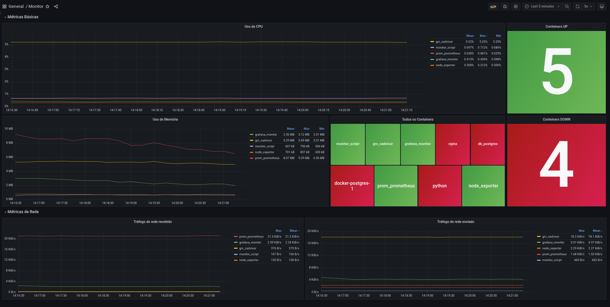

# Monitoramento de Containers

## Sobre o projeto

O projeto foi desenvolvido com o objetivo de facilitar o monitoramento do desempenho dos containers e do host, utilizando ferramentas que coletam, armazenam e exibem métricas de forma eficiente.

## Ferramentas utilizadas

Nesse projeto utilizei
- cAdvisor - Framework que coleta métricas dos containers Docker.
- Node Exporter - Ferramenta para coletar métricas do host.
- Prometheus - Sistema de monitoramento e armazenamento de métricas.
- Script Python - Responsável por coletar métricas dos containers que estão parados a muito tempo.

## Configuração

### Requisitos

- Docker

Caso não possua o Docker instalado pode instalá-lo via script oficial com o comando

    curl -fsSL https://get.docker.com | bash

### Passo a passo

1. Primeiro crie uma rede no Docker com o comando.

        docker network create --driver bridge --subnet=192.168.1.0/24 monitoramento

2. Acesse o diretório `docker` e dentro dele execute o arquivo `compose.yml`.

        docker compose up -d

3. Verifique se os containers foram criados e estão funcionando da forma correta.

        docker ps 

    A saída deverá mostrar cinco containers Docker em execução em background.

4. Com tudo funcionando normal, podemos configurar o Grafana para utilizar o Prometheus e mostrar as métricas no Dashboard.

    4.1 Acesse a url do Grafana.

        http://localhost:3000

    4.2 Configure o Data Source

    1. Faça login no Grafana (usuário e senha padrão: `admin`/`admin`, caso não tenha alterado).
    2. No menu lateral, clique em **Configuration** > **Data Sources**.
    3. Clique em **Add data source** e selecione **Prometheus**.
    4. Insira a URL do Prometheus (geralmente `http://localhost:9090`).
    5. Clique em **Save & Test** para validar a conexão.

    4.3 Importe o Dashboard

    1. No menu lateral, clique em **Dashboards**.
    2. Clique em **New Dashboard** e, em seguida, em **Import**.
    3. Copie o conteúdo do arquivo `template.json`, localizado no diretório `grafana` deste repositório.
    4. Cole o conteúdo no campo de importação ou use o botão de upload para carregar o arquivo.
    5. Clique em **Import** para adicionar o dashboard.

    4.4 Carregando o Dashboard

    Caso o dashboard não seja carregado corretamente na primeira tentativa:  
    1. Acesse o painel problemático clicando nele.
    2. No menu de opções, clique em **Edit**.
    3. Faça qualquer alteração simples (exemplo: altere uma métrica temporariamente).
    4. Clique em **Run queries** para recarregar os dados.
    5. Desfaça as alterações realizadas e clique em **Save**.

    Após esse procedimento, o painel deverá estar funcionando normalmente.

## Funcionamento

O projeto funciona da seguinte forma, o cAdvisor coletar métricas em tempo real dos containers que estão em execução,
já o script coleta métricas dos containers que estão parados há muito tempo. O cAdvisor por si só não coleta métricas 
de containers que estão parados há muito tempo. Já que o intuito do cAdvisor é analisar métricas dos containers que estão
em execução.

### Por que utilizar cAdvisor?

O cAdvisor é focado em métricas de curta duração, dessa forma ele age coletando métricas dos containers que estão
em execução no momento. Ele não é ideal para manter um histórico longe de containers antigos ou pausados/removidos.
Containers que estão no estado `Exited` são descartados do monitoramento do cAdvisor após um certo periodo. Para coletarmos métricas de containers que estão no estado `Exited` nós utilizaremos o script em python.

### Como funciona o script Python?

O script python é focado em pegar as métricas dos containers que estão parados há mais tempo. Ele funciona basicamente
dando um comando `docker ps -a`, após ele obter os resultados via cli, ou seja, via linha de comando, ele verifica os containers
que estão com o estado `Exited`. Com as informações obtidas o script expõe um endpoint com as métricas fornecidas no formato do 
Prometheus.

#### Exemplo
 
        # HELP container_status Container status (1 = running, 0 = exited)
        # TYPE container_status gauge
        container_status{name="monitor_script",image="docker-monitor_script:latest",status="running"} 1
        
### Prometheus

O Prometheus fica responsável por fazer a coletas das métricas. Com o Prometheus nós podemos criar alertas personalizados com base no melhor caso de uso para quem for aplicar. O mais interessante é que containers que contém aplicações críticas podem ter seus status monitorados atráves do script. Caso o container para inesperadamente pode ser disparado um alerta para o time responsável.

### Grafana

Com o Grafana nos podemos criar dashboards que se adequem a cada caso de uso.

## Conclusão

A combinação do cAdvisor para monitoramento de containers em execução e o script Python para containers `Exited` permite uma visão abrangente e contínua da saúde dos containers em seu ambiente Docker. Usando o Prometheus para coletar e expor métricas, podemos criar alertas e garantir que containers críticos sejam monitorados de forma eficiente, mesmo após sua parada.

## Possibilidades de Melhorias

O projeto está disponibilizado para a comunidade. Assim, quem for utilizar pode adequar o script a sua maneira para coletar as métricas da melhor forma. Pode-se ainda fazer uma melhoria na coleta de métricas do cAdvisor e nas configurações do Prometheus.

## Referências 

Aqui estão as principais referências que usei:

- [Monitoring Docker Containers with cAdvisor, Prometheus, and Grafana Using Docker Compose](https://medium.com/@varunjain2108/monitoring-docker-containers-with-cadvisor-prometheus-and-grafana-d101b4dbbc84)
- [Documentação Prometheus](https://prometheus.io/docs/tutorials/getting_started/)